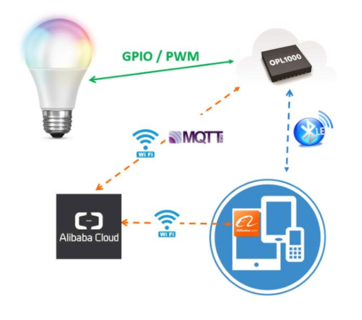

## Function / Feature
- This reference is a basic smart lighting design. Device can be controlled by App which is running mobile device then upadte the status of light to cloud. 
- Ali could MQTT protocol is supported.
- Single chip solution, application runs on OPL1000 M3 MCU.
- Adopt BLE configure WIFI AP to connect Internet / cloud. 
- Smart sleep and auto-connection are support. 
- Easy to configure work parameter by ParamCfg.exe tool. 
- Automatically complete project compile and download operation.  

## Work Frame

## Directory and Content 

**app** folder

- Contains Ali cloud app and project configuration ini file. 

**prj_src** folder

- Contains reference design source code, include library, implementation c code and project files. 

**Doc** folder

- Contains application guide document. 

## Develop application based on reference

User can develop sensor type application based on provided reference design. Generally it includes 4 steps.

1.  Register and create product/device on Ali cloud, define its property and get  "3 element set" parameters for application development. 
2.  Modify / extend functions based on existing reference design.
3.  Create Ali cloud APP and hook IOT devices to this App. 
4.  Verify message transferring  between IOT device, cloud and mobile APP, and validate functions / features.  
