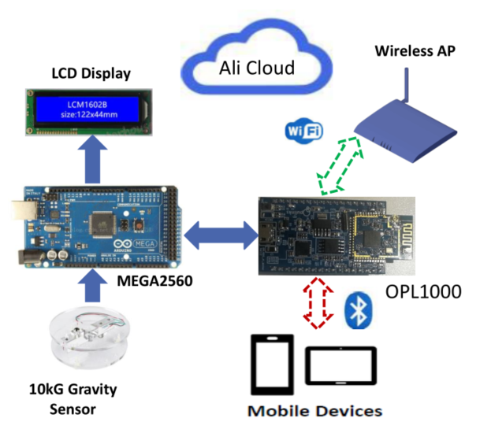

## Function / Feature
- This reference realizes a simple smart scaler function, it measures weight and upload to Ali cloud. 
- Ali could MQTT 3.1 protocol is supported.
- Two chips solution. External MCU uses Arduino Mega2560, OPL1000 acts as slave device. 
- External MCU takes charge of weight measure and LCD display, OPl1000 acts transport module.
- Adopt BLE configure WIFI AP to connect Internet/cloud. 
- Smart sleep and auto-connection are supported. 
- Easy to configure work parameter by ParamCfg.exe tool. 
- Automatically complete project compile and download operation.  

## Demo video
- [*Opulinks scaler demo @ Youku*](https://v.youku.com/v_show/id_XNDA5Nzc5NzEyMA==.html?spm=a2h3j.8428770.3416059.1)
- [*Opulinks scaler demo @ Youtube*](https://youtu.be/3wrcTyPg6G0)

## Work Frame

## Directory and Content 

**app** folder

- Contains Ali cloud app and project configuration ini file. 

**prj_src** folder

- Contains opl1000 firmware source code and Arduino MCU firmware. 
- OPL1000 firmware code include library, implementation c code and project files. 

**Doc** folder

- Contains application guide document and weight sensor/LCD control circuit diagram. 

## Develop application based on reference

User can develop smart scaler type application based on provided reference design. Generally it includes 5 steps.

1.  Register and create product/device on Ali cloud, define its property and get  "3 element set" parameters for application development. 
2.  Porting Arduino Mega2560 firmware (c code) into user own external MCU.
3.  Modify/extend OPL1000 firmware functions based on existing reference design.
4.  Create Ali cloud APP and hook IOT devices to this App. 
5.  Verify message transferring between IOT device, cloud and mobile APP, and validate functions/features.  
